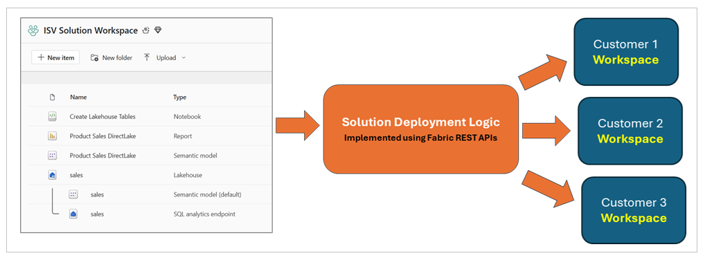
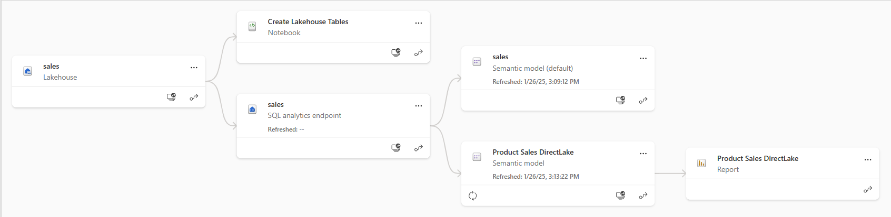
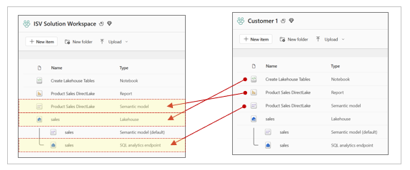

# Automating Fabric Solution Deployment

This document is designed to help you understand essential concepts with
Fabric CI/CD.

Ddd

Preview what we will be using from Fabric REST APIs.

Create workspaces using the **Create Workspace** API.

Create connection using the **Create Connections** API. .

Create workspace items using item definitions and the **Create Item**
API.

Retrieve item definitions using the **Get Item Definition** API.

Update the definition for existing workspace items using the **Update
Item Definition** API.

Here are the demonstration deployment workflows

- Demo 1 - Deploy Fabric Solutions using Item Definitions

- Demo 2 - Deploy Fabric Solutions using Workspace Template

- Demo 3 – Deploy Fabric Solutions using Source Control with Item
  Definition Files

Demo 1 - Deploy solutions using item definitions

***graphic***

Demo 2 - Deploy solutions using Workspace Template

***graphic***

Demo 3 – Deploy solutions using Item Definitions from Source Control

***graphic***

## Managing Workspace Item Dependencies

With a Fabric workspace, workspace items will often have dependencies on
other workspace items. For example,

When deploying a solutions, you must understand these dependencies.

- **Lakehouse** has no dependencies on other workspace items

- **Notebook** has dependencies on workspace id & lakehouse id of
  default lakehouse

- **DirectLake semantic model** depends on SQL endpoint connect string
  and database Id

- **DirectLake semantic model** might depend on running a notebook to
  create lakehouse tables

- **Report** depends on id of semantic model to which it is bound

When cloning a

xxx

Item

For this reason, a Fabric solution must deploy its workspace items in
this order

- Lakehouses

- Notebooks

- Semantic models

- Reports

And now a little more detail about the workflow

- Create lakehouse

  - Track lakehouse id for later use when updating notebook dependency

  - Track lakehouse properties which provide connection information for
    SQL endpoint

  - Track lakehouse name to later determine which semantic models are
    default for lakehouse

- Create notebooks

  - Create notebook using item definition which is updated to include
    workspace id & lakehouse id

  - Run notebook and monitor execution until completion to ensure
    lakehouse tables are created

- Create DirectLake semantic models

  - Create semantic model using updated item definition that includes
    SQL endpoint connect string

  - Track semantic model id for later use when binding report

  - Create SQL connection to lakehouse SQL endpoint and bind it to
    semantic model

  - Refresh semantic model

- Create Power BI reports

  - Create report using updated item definition that includes semantic
    model id

Summary of section

## Demo 1 - Deploy Fabric Solutions using Item Definitions

## Demo 2 - Deploy Fabric Solutions using Workspace Template

## Demo 3 – Deploy Fabric Solutions using Source Control with Item Definition Files
