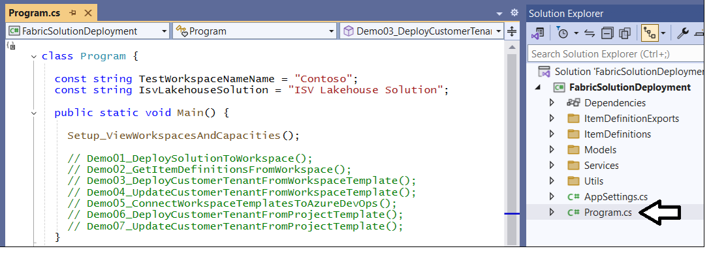
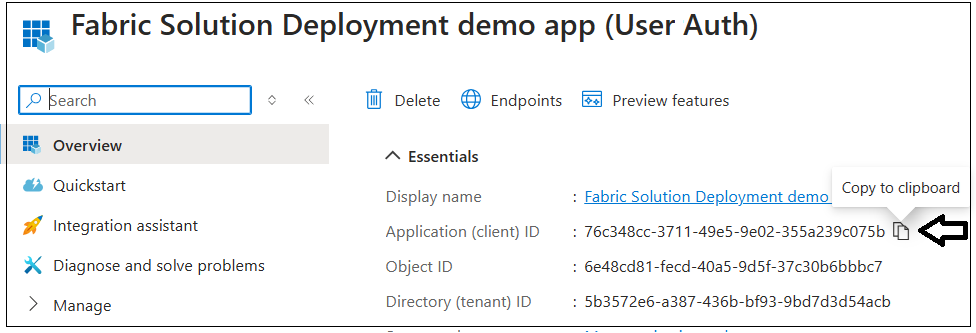
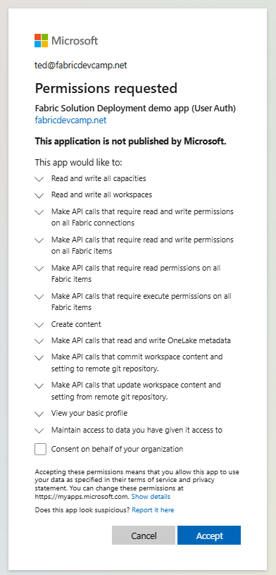
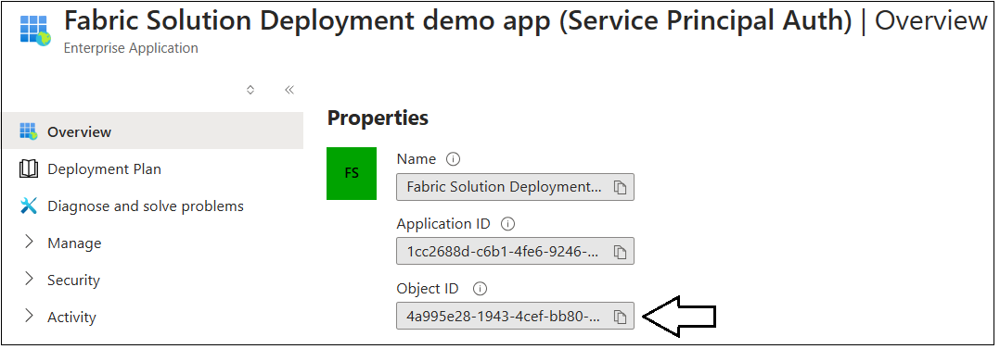

# Getting Started

> This setup guide is designed to help you get up and running with the
**FabricSolutionDeployment** sample application.

Once you download the **FabricSolutionDeployment** project, you can open and test it
using any version of Visual Studio 2022 including the free community
version. While this project hasn't been tested using VS Code, you should be able to
use that developer experience instead of Visual Studio as long as you have the .NET/C# extensions
installed.

When you open the project, start by examining **AppSettings.cs**. This
is a settings file with configuration data you need to modify with configuration data for your
Fabric environment. The following screenshot shows you what this file looks like when
you first open it.

You can see some configuration values are initially set to **00000000-0000-0000-0000-000000000000** which 
are empty GUID values. To make various demos run correctly, you will be required to replace these default values with Ids that are unique to your development environment. 

However, you don't need to modify anything in **AppSettings.cs** before you run this
application for the first time. When you start up and run the project
for the first time, you will be prompted to login. Log in using a user
account with access to your Fabric development environment.

>When you login in for the first time, Entra Id might prompt you with a **Permissions request** consent dialog asking you to consent to permissions requested by the application. Click **Accept**
to grant the permission request and continue running the application.

Once you login, the application will execute two Fabric REST API calls to retrieve 
lists of the workspaces and capacities to which you have access in the current Entra Id tenant.
The application then displays these workspaces and capacities in the console window. 

> The **Capacities List** shows you what capacities that your
user account has permissions to access in your development environment.

For testing, you must have acces to a Fabric-enabled capacity. You can use any capacity created from an **F** SKU or a **P** SKU. Alternatively, you can also use a Fabric trial capacity with an **FT1** SKU as shown in the screenshot above. 

Here is where you need to determine which capacity to configure for use
with the **FabricSolutionDeployment** application. You need to select a Fabric-enabled capacity and
add its capacity ID to **AppSettings.cs**. This is required so the
application can assign the workspaces it creates to this capacity.
Once you determine which capacity you want to use, copy its capacity Id value
into the **FabricCapcityId** constant value in **AppSettings.cs**.

> If you do not see a Fabric-enabled capacity in the capacities list, that is a problem you must address 
before continuing with these setup instructons. That's because the
**FabricSolutionDeployment** sample application cannot work correctly if it doesn't have the ability
 to create Fabric workspace items such as lakehouses and notebooks.

## Configuring access to sample data files in an Azure storage container
The **FabricSolutionDeployment** application executes sample workflows which require accessto  data files
inside an Azure storage account container. More specifically, there is a sample workflows which creates 
OneLake shortcuts to access data files in Azure storage. There is a second sample workflow 
which creates and then runs a data pipelinewhich to copy data files from Azure storage 
to the **Files** section of a lakehouse. In order to successfully run these sample workflows, 
you will neeed to work through the following setup instructions.

- Download the sample data files from **ProductSales.zip**.
 - Create an Azure stroage account with support for ADLS Gen2 storage
 - Upload sample data files to a container in that storage account
 - Obtain an Azure storage account key or SAS key to access the target container 
 - Configure data paths and the Azure account key in the **AppSettings.cs** file 

Start by downloading the **ProductSales.zip** file to the **Downloads** folder on your local machine using the following link.

  - [https://github.com/FabricDevCamp/SampleData/raw/refs/heads/main/Downloads/ProductSales.zip](https://github.com/FabricDevCamp/SampleData/raw/refs/heads/main/Downloads/ProductSales.zip)

Once you have downloaded **ProductSales.zip**, locate the ZIP archove file in the **Downloads** folder. 

 

 Open **ProductSales.zip** in Windows Explorer and locate the top-level folder named **ProductSales**. 

 Copy the **ProductSales** folder from inside the ZIP archive. After that, paste the  **ProductSales** folder into a folder on your local
 drive such as **C:\DataFiles** as shown in the following screenshot.

Take a moment to become familiar with the structure of child folders inside the **ProductSales** folder. 
There is a child folder named **Customers** which contains child folders 
named **AdventureWorks**, **Contoso**, **Northwind** and **Wingtip**. 
There are three additional folders inside the **ProductSales** folder named **Dev**, **Test**, and **Prod**.

 

In total, there are seven seperate folders which each contain their own unique set of data files. 
Each folder contains four CSV files named **Customers.csv**, **Invoicescsv**, **InvoiceDetails.csv** and **Products.csv**.
The following screenshot shows an example of the four standard CSV files in the **Customers/Contoso** folder.

 

>The data files in each of the seven folders share a common table schema. Workflows implemented by
the **FabricSolutionDeployment** application use these files to build out table sschemas in lakehouses as wel as in imported semantic models.
Keep in mind that the  only difference between the data files in each folder is that the rows of data are different.

The folders named **Dev**, **Test**, and **Prod** provide three different sets of sample data files used to simulate the difference 
between environments in a staged deployment. 
This sample data will be used to configure a staged deployment which requires configuring each stage with its own unique 
datasource paths. After all, you really don't want your developers accessing the same data as business users working 
in a production environment. 

Now that you have a copy of the sample data files, the next step is to create a new Azure storage account with ADLS Gen2 support.

>For the next step, you need an Azure subscription. If you don't have your own Azure subscription, 
you will need to engage the assistnce of someone that does to complete this step.

### Create an Azure storage account with support for ADLS Gen2 storage
Navigate the the Azure portal and click **Create a resource**. 

 

Locate the Microsoft **Storage account** and click **Create** to begin the process of creating a new Azure storage account.

 

>To create an Azure storage account which supports ADLS Gen2 storage, you must enable the **Enable hierchical namespace** setting. 
This is important when creating a storage account because this setting cannot be changed after the 
storage account has already been created.

When creating the new account enter a name such as **devcampteststorage** as shown in the following screenshot. After entering a name,
 click the **Next** button to navigate to the **Advanced** settings page
where you can set the **Enable hierchical namepsace** option.

 

 On the **Advanced** settings page, select the **Enable hierchical namepsace** option and click **Review + create** 
 to continue.

 

On the **Review + create** page, verify **Storage account name** and **Enable hierchical namepsace** and click **Create**.

 

 >After creating the new storage account, the next step is to create a new container. 
 
 Click the **Data storage > Container** link on the left to move to the **Containers** page and then click **Add(+) Container**. 

 

In the **New container** pane, enter a container name of **sampledata** and click **Create** to create the new container.

 

After creating the container, click on **sampledata** in the **Containers** page to open it in the Azure portal.

 

On the **sampledata** container page, click **Upload** to start the process of uploading the sample data files.

 

> Now you need to return to Windws Explorer and navigate to the local copy of the **ProductSales** folder downloaded earlier.

Drag and drop the local folder **ProductSales** onto the target **drag and drop files here** zone in the **Upload blob** pane.

 

 Click the **Upload** button to begin uploading all data files in the **ProductSales** folder.

 

 After all files have been uploaded, open the **ProductSales** folder in the **smpledata** container. 

 

 Open the **Dev** folder to examine what's inside.

 
 
You should be able to verify the folder contains four files named **Customers.csv**, **Invoicescsv**, **InvoiceDetails.csv**, and **Products.csv**.

 

>Note that the **Dev** folder will be configured as the default location for the datasources used for 
creating connection. shortcuts, data pipelines and semantic models. In the lab which covers staged deployments, 
you will use trhe folders **Dev**, **Test** and **Prod** to configure a different datasource path for eacg environment.

 To test multitenancy, there are also several customer-specific folders inside the **Customers** folder. 

 

 Here we go.

 

 Here we go.

 

 Here we go.

 

 Here we go.

 

Here we go.

 

Blah

## Running through lab exercises

Open the source file named **Program.cs** and locate the function named **Setup_ViewWorkspacesAndCapacities** .  

Comment out the line that calls **Setup_ViewWorkspacesAndCapacities** and uncomment the next line
to call the function named **Demo01_DeploySolutionToWorkspace**. The next time you run the application it should execute the code for **demo 1** which creates and populates a new workspace named **Contoso**. 

> You've now configured what's required to run **demo 1** through **demo 4**. 
It is simply a matter of commenting out one functions and uncommenting the next.
To run through the first four demos, use the instructions in 
**[Automating Fabric Solution Deployment](https://github.com/FabricDevCamp/FabricSolutionDeployment/blob/main/docs/Automating%20Fabric%20Solution%20Deployment.md)**.

If you want to run **demo 5** through **demo 7**, you will need to configure additional support in 
**AppSettings.cs** for an Azure DevOps organization. For this, you will need access
to an Azure DevOps organization in the same Entra Id tenant as the development environment where you are creating Fabric workspaces. Once you determined which Azure DevOps organization to use, you can configure it in **AppSettings.cs** by updating the value for a constant named **AzureDevOpsOrganizationName** which is shown in the following screenshot.

For example, if you Azure DevOps organization is named **FabricDevCamp**, you should update the configuration value for **AzureDevOpsOrganizationName** in **AppSettings.cs** 
to look like this.  

Note that this sample application contains code that uses the Azure REST API to create new projects
in an Azure DevOps organization. It also has code to push files to an Azure DevOps repository and commit the changes as well as code to retrieve files from a repository. For anyone interested in seeing how this code has been written, you can examine the source code for the class named [**AdoProjectManager**](https://github.com/FabricDevCamp/FabricSolutionDeployment/blob/main/FabricSolutionDeployment/Services/AdoProjectManager.cs) class.

If you don’t already have access to an Azure DevOps organization, you
can set up support for this pretty quickly without having to purchase anything. Once
you log into your Fabric user account, you should be able to activate a
free Azure DevOps account and create an Azure DevOps organization by
following to this link.

- **<https://dev.azure.com/>**  

> Note that Fabric supports using repositories for GIT integration using
either Azure DevOps or GitHub. However, this project currently only has
support for Azure DevOps. Adding support for GitHub is left as an exercise for the reader.

## Understanding Authentication Modes

The **FabricSolutionDeployment** application supports three possible 
configure settings for the application's **authentication mode**.
 If you leave the configuration with the default setting
as shown in the following screenshot, things should just work out-of-the-box. 
There is no need to create an Entra Id application before you run 
the he **FabricSolutionDeployment** application in the Visual Studio
debugger. 

The default for the **AuthenticationMode** setting is **UserAuthWithAzurePowershell**.
The reason this default authentication mode setting *just works* 
is because the application is configured to use a pre-installed 
Entra Id application known as the **Azure PowerShell** application. 
This application is automatically available in every Entra Id
tenant and you can use it to acquire user access tokens for the Fabric REST
APIs.

>As you can see, the default authentication mode setting has been designed to get
you started quickly because it eliminates the need to create a custom Entra Id application. 

If you want to test the **FabricSolutionDeployment** application using a custom 
application you have created in Entra Id , you can configure **AuthenticationMode** to 
a setting of either **UserAuth** and **ServicePrincipalAuth**. 

> The next two sections explain how to create custom Entra Id applications aswell as  how to configure them in the **FabricSolutionDeployment** application to test out deployment workflows that run as either a user or as a service principal.

## Configuring User Authentication with a Custom Entra Id Application

If you want to use **UserAuth** mode, you must create a Entra Id
application as a public client application in the same Entra Id tenant 
where you are creating workspaces. When you create a new Entra Id application in the
Entra Id portal, you should configure the **Redirect URI** as **Public
client/native** and set the URI value to **http://localhost** as shown
in the following screenshot.

After clicking **Register** to create the new Entra Id application, you
should be able to copy the application’s client Id to the clipboard so
you can paste it into **AppSettings.cs** as shown in the following
screenshot.

After you have created the Entra Id application for user authentication,
you need to make two changes to **AppSettings.cs**. First you need paste
the client Id of the Entra Id application into the value for the
constant named **UserAuthClientId** as shown in the following
screenshot. Second, you must update the value of the constant named
**AuthenticationMode** to **UserAuth**.

When you start the application for the first time after configuring
**UserAuth** mode, you will be prompted by Entra Id to sign in. Once you
have signed in, Entra Id will then prompt you with the **Permissions
request** consent dialog asking you to consent to the delegated
permissions that this application has requested. You should click
**Accept** to continue.

> Now the application will authenticate you with the custom Entra Id application and run under 
the identity of your Entra Id user account.

## Configuring Service Principal Authentication with a Custom Entra Id Application
If you want to run the **FabricSolutionDeployment** application as a service
principal, you must create an Entra Id application that is configured
as a confidential application with a client secret. You must also configure the service principal
in the Fabric Admin portal with the tenant-level setting **Service principals can use Fabric APIs**. 
These instructions will cover how to accomplish each of these setup steps.  

When you create a new Entra Id application for a service principal in the Entra Id portal, you should configure the **Redirect URI** as **Web** and leave the URI value blank as shown in the following screenshot.

> Redirect URIs are only used for user authentication. There is no need to add a redirect URI when creating an Entra Id application for a service principal.

After clicking **Register** to create the new Entra Id application, you
should be able to copy the application’s **client Id** and **tenant Id** to the clipboard so
you can paste it into **AppSettings.cs** as shown in the following
screenshot.

Next, you need to create a new client secret and paste its value into **AppSettings.cs**. 
Navigate to the **Certificates & secrets** page and then click **New client secret**.

Enter a name for the new client secret and then click **Add**.

After creating the new client secret, copy its value into the Windows clipboard so 
you can paste it into **AppSettings.cs** n the next step.

Return to the **AppSettings.cs** file in Visual Studio and locate the four constants
used to configure support for a service principal.

Update the first three configuration settings with the **tenant Id**, 
the **the client Id** and the **client secret** of the Entra Id application.

The next step for configuring the **ServicePrincipalObjectId** setting for the service principal
is a little bit tricky. You need to configure the **ServicePrincipalObjectId** setting so you can 
run deployment workflows that add the service principal as a workspace member. When you want to use the Fabric REST API to add a workspace role assignment for a service principal, you must call the API by pasisng the **service principal object Id** instead of the application's **client Id**.

The discover the **service principal object Id** for an Entra Id application, navigate to 
the **Overview** page of the Entra Id application and then click the link that
has the label of **Managed application in local directly**.

When you click the **Managed application in local directly** link, you will navigate 
to new page from which you can copy the **Object ID** value
which is the service principal object Id. 

As a last step, paste the service principal object Id value into **AppSettings.cs**
as shown in the following screenshot.

The next step is to set the **AdminUserId** value in **AppSettings.cs**. This configuration
value is important when you start running the demo workflows as a service principal
because it allows you to access the Fabric portal using your user account to see what has been created 
by the service principal.

>Let's take a step back and examine the issue that is addressed with the **AdminUserId**
configuration value. If you create a workspace as a service principal,
that service principal will be the only identity that can access that
workspace. That means you will not be able to inspect that workspace in
the Fabric portal under the identity of your user account. Therefore, the
sample application has been designed to add any user account (*which
should be your user account*) as a workspace admin. After a service
principal creates a workspace, it will add an **Admin** workspace role assignment
for your user account so it has full access to inspect the workspace in the Fabric portal.

If you look at the bottom of the following screenshot, you will see a
constant named **AdminUserId**. You need to configure this constant with
the object id associated with your Entra Id user account.

There are several different ways you can get the object Id for your Entra Id
User account. One way is to navigate to the Entra Id admin center.
Next, click **Users** in the left navigation menu. If you click on your user
account, you should navigate to a page from which you can copy
the **Object ID** associated with your user account.

Use that **Object ID** to update the **AdminUserId** constant
in **AppSettings.cs**.

>There still remains an extra configuration step that needs accomplished before a service principal has the permissions it needs to call the Fabric REST APIs. 

### Configure the Tenant-level Setting 'Service principals can use Fabric APIs'
By default, a service principal does not possess the required permissions to call the Fabric REST APIs. Instead, a service principal must be configured in the Fabric admin portal using the tenant-level setting **Service Principals can use Fabric APIs**.

One complication with the **Service Principals can use Fabric APIs** setting is that you cannot directly add a service principal in the Fabric Admin portal. Instead, you can only configure this setting with users and Entra Id groups. The way to configure permissions for a service principal is by following these steps.
 
 1 Create a new security group in Entra Id with a name like **Fabric REST API Applications**
 2 Add the service principal as members of the **Fabric REST API Applications** group
 3 Add the **Fabric REST API Applications** group to the **Service Principals can use Fabric APIs** setting.

Complete step by by navigating to the Entra Id portal and creating. 

Create a new security group named **Fabric REST API Applications**.

Next, add the service principal as a group member.

Once you have created the Entra Id group and added the service principal as a member, the next step is to navigate to the Fabric Admin portal to configure the **Service Principals can use Fabric APIs** setting. 

>Note the next step can only be completed by a user who has been cofigured in the current Enta Id tenant 
as a **Fabric Administrator**. If you do not have these permissions in your development environment,
you must find someone who does to assist you in completing this step. 

Navigate the the Fabric Admin portal using the following URL.

 - https://app.powerbi.com/admin-portal/tenantSettings?experience=power-bi

Scroll down in the **Tenant settings** page to the **Developer settings** section.
Enabled the **Service Principals can use Fabric APIs** setting and configure it by
adding the the **Fabric REST API Applications** group as shown in the following screenshot. 

After a few minutes, your service principal should be able to successfully execute calls on
the Fabric REST APIs. Keep in mind that any Fabric REST call from a service principal that has not 
been correctly configured with  the **Service Principals can use Fabric APIs** setting
will fail with a **401 Unauthorized** error.

>Once you have configured a service principal with the **Service Principals can use Fabric APIs** setting, it will have the permissions it needs to call the Fabric REST APIs. But this does not mean that the service principal will automatically have access to any workspaces or workspace items. That’s because a service principal has no default access to any workspaces. In this sense, a service principal is treated just like a user with respect to Fabric authorization policies.

If you want to enable a service principal with access to a specific workspace, you must assign the service principal to a workspace role. You can add a service principal into a workspace role such as **Admin**, **Member**, **Contributor** or **Visitor**. Once you add a service principal to a workspace in a role such as **Admin** or **Member**, the service principal will have the permissions it needs to begin creating workspace items.

In multitenant application development, it’s a best practice to automate the creation of workspaces using service principals. When you create a workspace using a service principal, it’s automatically assigned to the **Admin** role which provides full read-write access to the workspace and the workspace items inside.

### Configure Azure DevOps Organization Permissions for the Service Principal

If you want to run **demo 5** through **demo 7** as a service principal, you must first 
configure permissions for the service principal in the Azure DevOps organization 
in which you're testing solution deployment workflows.

>This step is required so that the service principal has permissions
to create and delete Azure DevOps projects as well as permissions to read and write workspace item definition files to Azure DevOps repositories.   

Start by navigating to your organization in Azure DevOps and click the **Organization settings**
link in the bottom right corner of the page.

Navigate to the **Users** page and add your service principal as a member with an **Access level** of **Basic**. 

Navigate to the **Permissions** page and then the **Users** tab. Locate and click on
your service principal to open the **Permissions** page. 

On the **Permissions** page, configure your service principal with the following permissions.

 - **Create new projects**
 - **Delete team  project**
 - **Edit instance-level information**
 - **View instance-level information**

>Congratulations. You have now reached the end of this setup guide. 
