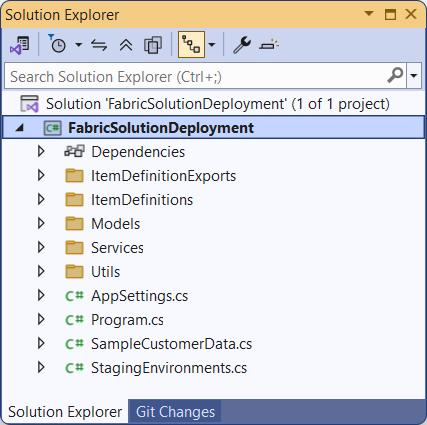
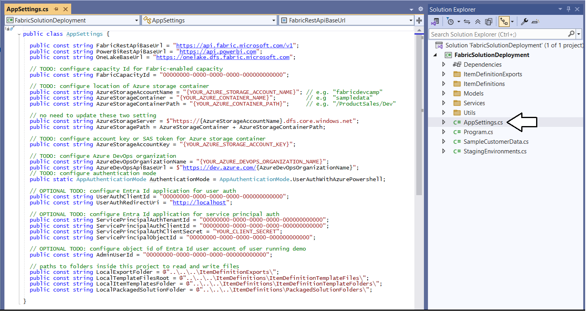
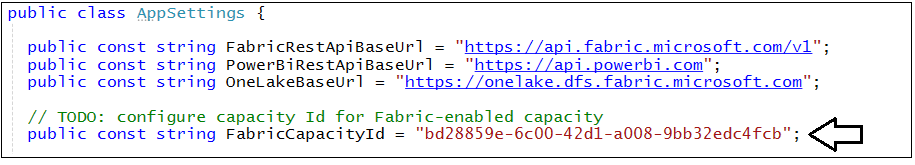
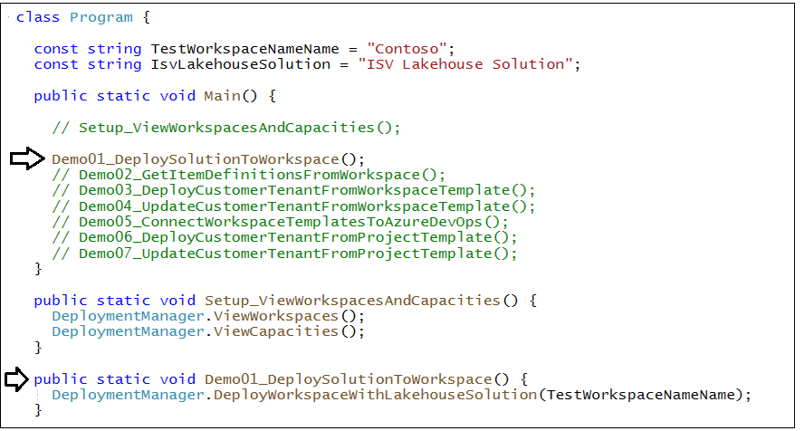
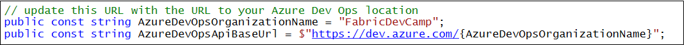
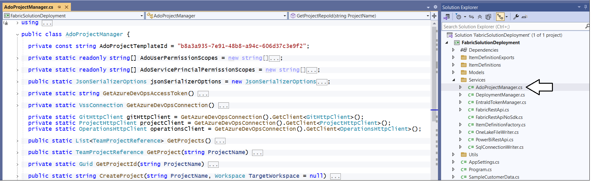
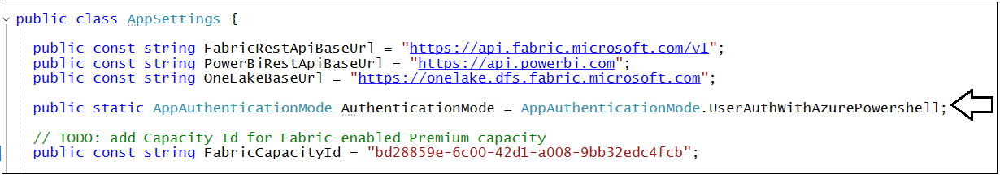
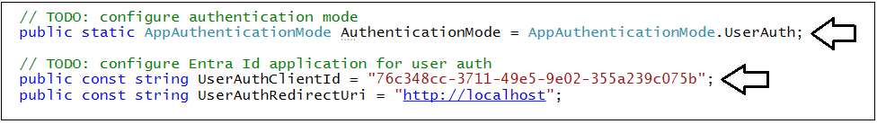
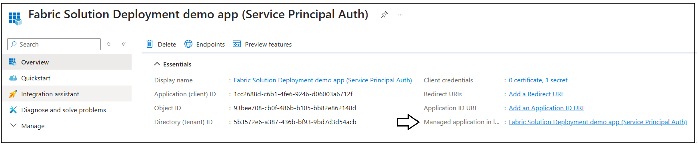

# Getting Started

> This setup guide is designed to help you get up and running with the
**FabricSolutionDeployment** sample application.

Once you download the **FabricSolutionDeployment** project, you can open and test it
using any version of Visual Studio 2022 including the free community
version. While this project hasn't been tested using VS Code, you should be able to
use that developer experience instead of Visual Studio as long as you have the .NET/C# extensions
installed.

When you open the project, start by examining **AppSettings.cs**. This
is a settings file with configuration data you need to modify with configuration data for your
Fabric environment. The following screenshot shows you what this file looks like when
you first open it.

You can see some configuration values are initially set to **00000000-0000-0000-0000-000000000000** which 
are empty GUID values. To make various demos run correctly, you will be required to replace these values with Ids that are unique to your development environment. 

However, you don't need to modify anything in **AppSettings.cs** before you run this
application for the first time. When you start up and run the project
for the first time, you will be prompted to login. Log in using a user
account with access to your Fabric development environment.

Once you login, the application will execute two Fabric REST API calls to retrieve 
information about the workspaces and capacities in the current Entra Id tenant to which you have access.
The application then displays these workspaces and capacities in the console window as shown in the
following screenshot. 

> The **Capacities List** shows you what capacities that your
user account has permissions to access in your development environment.

Here is where you need to determine which capacity to configure for use
with the application. You need to select a Fabric-enabled capacity and
add its capacity ID to **AppSettings.cs**. This is required so the
application can assign the workspaces it creates to this capacity.

For testing you can use any Fabric capacity created from an F SKU or a P
SKU or you can also use a Fabric trial capacity. The screenshot above
shows that I have a Fabric trial shown by the code **\[FT1\] **. If you
do not see a Fabric-enabled capacity in the capacities list, you must
acquire one before continuing. If you are using a Fabric trial account,
note that will make it more difficult (but not impossible) to test
deployment using a service principal.

Once you determine which capacity you want to use, copy its ID value
into the **FabricCapcityId** constant value in **AppSettings.cs**.

Now you are ready to start running demo code from the application using
your user account. This will allow you to test out the demo CI/CD
workflows when authenticating as a user with your Entra Id user
account. 

Open the source file named **Program.cs.** You should be able to see the
code is initially set up to call a function named
**Setup_ViewWorkspacesAndCapacities** .  

Now you can comment out the line that
calls **Setup_ViewWorkspacesAndCapacities** and uncomment the next line
to run demo **Demo01_DeploySolutionToWorkspace**.

This will let you run tests and demo workflows to create workspaces and
workspace items. It is simply a matter of uncommenting the functions you
want to test out.

If you want to test out this project support for GIT integration, you
can uncomment the function named **ConnectWorkspaceToGit**. However, the
code behind this function will not work correctly until you have
configured **AppSettings.cs** with the name of the Azure DevOps
organization you are using for testing.

**AppSettings.cs** contains two constants for Azure DevOps shown below.

You need to add the name of an Azure Dev organization. For example, my
organization is named **FabricDevCamp,** so I have updated my settings
to look like this.  

You can see the **FabricSolutionDeployment** project has a class
named **AdoProjectManager** which uses the Azure REST API to interact
with Azure DevOps.

If you don’t already have access to an Azure DevOps organization, you
can set up support for this pretty quickly without having to purchase anything. Once
you log into your Fabric user account, you should be able to activate a
free Azure DevOps account and create an Azure DevOps organization by
following to this link.

- **<https://dev.azure.com/>**  

Getting access to an Azure DevOps organization is important for the later demo
workflows to work correctly. That’s because these demo workflows pull
item definition files directly from a GIT repository in Azure DevOps.

> Note that Fabric supports using repositories for GIT integration using
either Azure DevOps or GitHub. However, this project currently only has
support for Azure DevOps. There are plans add support for GitHub in a
future update to this project.

## Configuring Authentication Mode

Now a quick word about authentication. If you leave the configuration of
the application’s authentication mode with the default setting
in **AppSettings.cs** (shown below), things should just work. There
should be nothing to configure and no need to create an Entra Id
application before your run the application in the Visual Studio
debugger. That's because the application is configure to use a
pre-installed Entra Id application known as **Azure PowerShell
application**. This application is automatically available in every M365
tenant and can be used to acquire user access tokens for the Fabric REST
APIs as well as the Power BI REST API.

The default for the **AuthenticationMode** setting in **AppSettings.cs**
is **UserAuthWithAzurePowershell**.

This default authentication mode setting has been designed to get
started quickly because it just work out-of-the-box. This authentication
mode does not require you to create an Entra Id application. Note that
you can configure three different options for the authentication mode as
shown in the following screenshot. The two other available modes of
**UserAuth** and **ServicePrincipalAuth** will require you to create
Entra Id applications in order to use them.

### Configuring User Authentication with a Custom Entra Id Application

If you want to use **UserAuth** mode, you must create a Entra Id
application in the same M365 tenant where you are creating and testing
Fabric workspaces. When you create a new Entra Id application in the
Entra Id portal, you should configure the **Redirect URI** as **Public
client/native** and set the URI value to **http://localhost** as shown
in the following screenshot.

After clicking **Register** to create the new Entra Id application, you
should be able to copy the application’s client Id to the clipboard so
you can paste it into **AppSettings.cs** as shown in the following
screenshot.

After you have created the Entra Id application for user authentication,
you need to make two changes to **AppSettings.cs**. First you need paste
the client Id of the Entra Id application into the value for the
constant named **UserAuthClientId** as shown in the following
screenshot. Second, you must update the value of the constant named
**AuthenticationMode** to **UserAuth**.

When you start the application for the first time after configuring
**UserAuth** mode, you will be prompted by Entra Id to sign in. Once you
have signed in, Entra Id will then prompt you with the **Permissions
request** consent dialog asking you to consent to the delegated
permissions that this application has requested. You should click
**Accept** to continue.

### Configuring Service Principal Authentication with a Custom Entra Id Application

If you want to run the **FabricSolutionDeployment** application as a service
principal, you must create an Entra Id application that is configured
with a client secret. The service principal must also be configured
within the current M365 tenant, so it has permissions to call the Fabric
REST APIs. This includes configuring the service principal in the Fabric
Admin portal with the **Service principals can use Fabric APIs**
permissions. If the service principal is not configured properly, any
call the service principal makes to a Fabric REST API endpoint will fail
with a 401 error.

Once you have created the Entra Id application, you need to copy its
tenant id and client Id as well as the client secret so you can add them
to **AppSettings.cs**. Once you get the configuration information for
the service principal, you must add its into **AppSettings.cs**.

One part that is kind of tricking is getting
the **ServicePrincipalObjectId **value for the service principal. You
need that configuration value so you can demo workflows can add the
service principal as a workspace member. The easiest way I know to get
this value is to go to the Entra Id application **Overview** page and
click the **Managed application in local directly** link.

When you click the **Managed application in local directly** linkyou
will navigate to page from which you can copy the **Object ID** value
which is the service principal object Id. 

Now you have 4 settings which completes configuring the service
principal.

OK, you’re almost done. There is one more step which is to set
the **AdminUserId** value in **AppSettings.cs**. This configuration
value is important when you start running the demo workflows as a service principal.

Let's take a step back and explain the issue that is addressed with the **AdminUserId**
configuration value. If you create a workspace as a service principal,
that service principal will be the only identity that can access that
workspace. That means you will not be able to inspect that workspace in
the Fabric UI under the identity of your user account. Therefore, the
sample application has been designed to add any user account (*which
should be your user account*) as a workspace admin. After a service
principal creates a workspace, you user account will be given full
access to that workspace so you can inspect it in the Fabric UI and
continue to experiment.

If you look at the bottom of the following screenshot, you will see a
constant named **AdminUserId**. You need to configure this constant with
the object id associated with your Entra Id user account.

There are several different ways you can get the Object Id for your Entra Id
User account. The easiest way is to go to the Entra Id admin center.
Next, click **Users** in the left nav. If you click on your user
account, you should navigate to a page from which you can copy
the **Object Id** associated with your user account.

Use that **Object ID** to update the **AdminUserId** constant
in **AppSettings.cs**.

